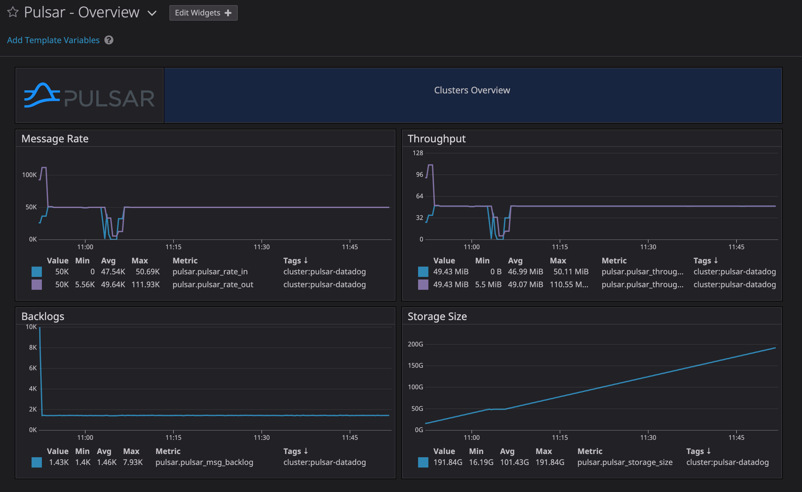
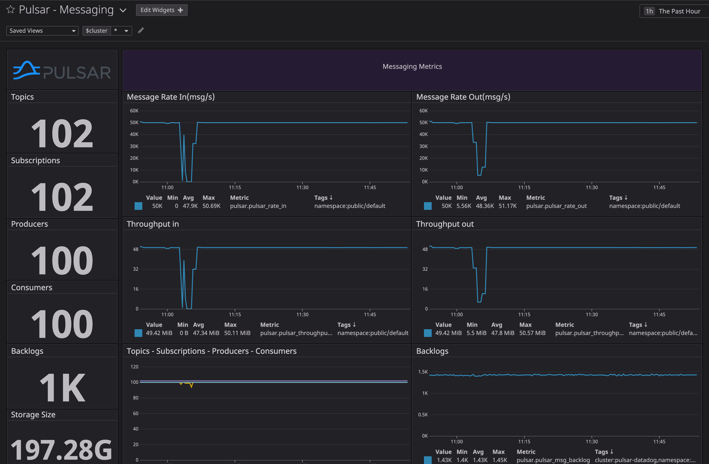
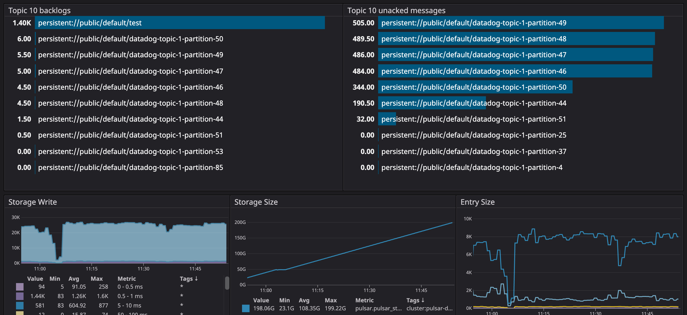
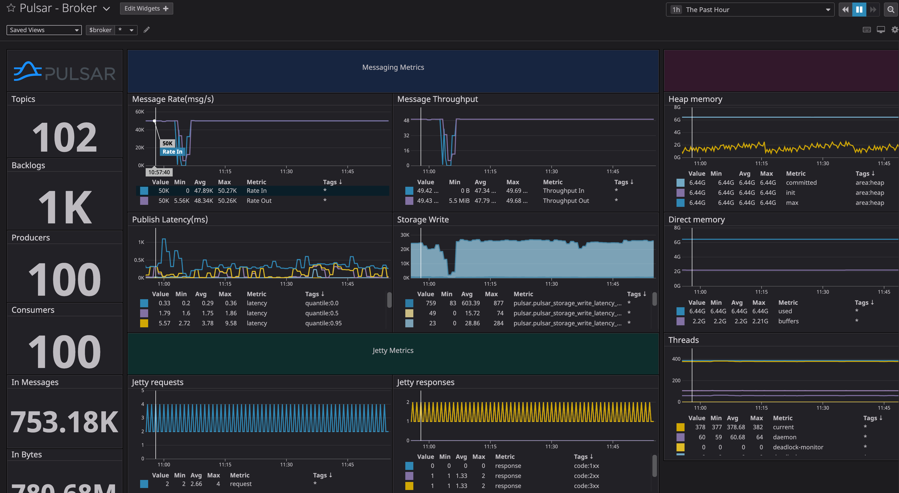
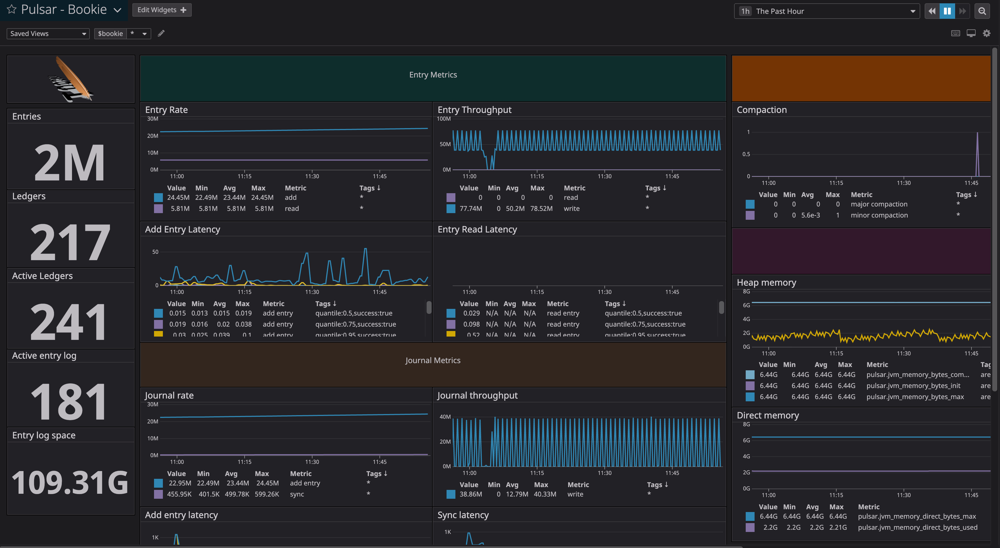
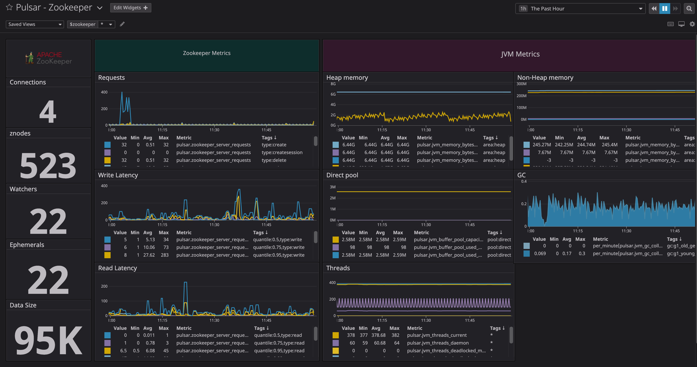
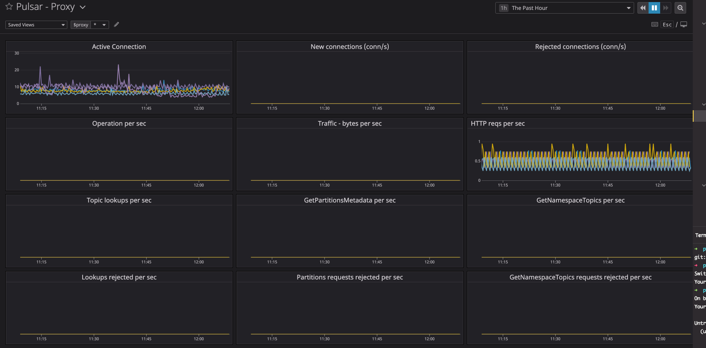

# Apache Pulsar & Datadog Integration

Integrate metrics and logs of Apache Pulsar with Datadog. Datadog supports integration with OpenMetrics(Prometheus) data format and Pulsar also can expose metrics in Prometheus data format. So we can easily inject Pulsar metrics into Datadog with OpenMetrics data format. This does not require the installation of the Prometheus server. You can done the integration through following steps:

#### 1. Install Datadog agent

The Datadog agent is required for injecting Pulsar metrics to Datadog. Datadog supports agents on multiple platforms, you can visit https://app.datadoghq.com/account/settings#agent to install Datadog agent on your machine and there is an easy one-step install.

#### 2. Enable Datadog collector for Pulsar component

The collector configuration files are under the configs directory, you can copy them to the OpenMetrics configuration directory of the Datadog agent and then restart the agent.

#### 3. Import Pulsar dashboards

The Pulsar dashboards JSON files are under the dashboards directory. You can import these dashboards into your dashboard list in the Datadog. Below are screenshots of  dashboards:

##### Overview Dashboard

##### Messaging Dashboard

##### Broker Dashboard

#### 

##### Bookie Dashboard

##### Zookeeper Dashboard

##### Proxy Dashboard

